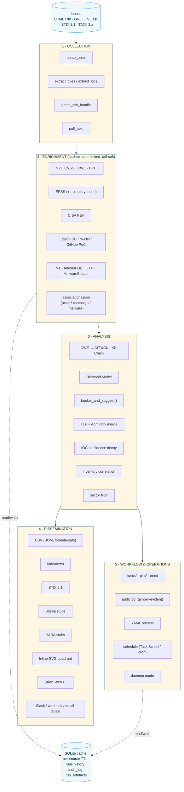
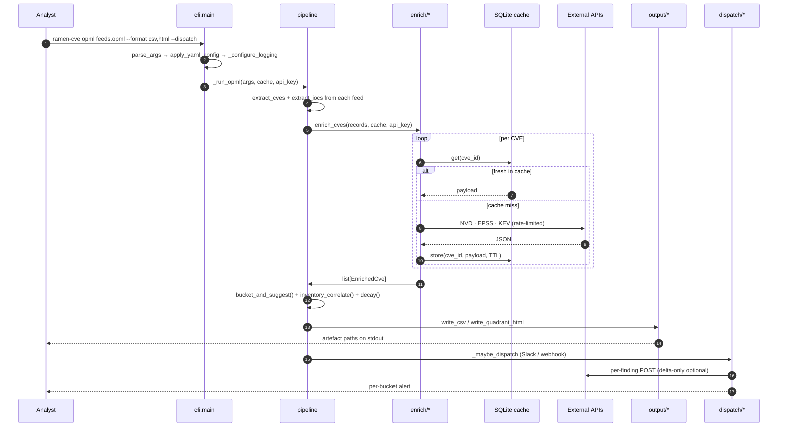
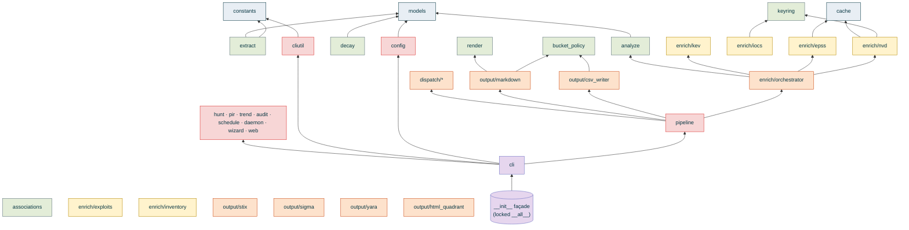

# Threat Intel on a Ramen Budget — A Technical Whitepaper

> **Scope.** Conceptual companion to the BSidesSLC 2026 talk —
> problem statement, methodology, security posture. For
> install / usage / configuration, see [`README.md`](../README.md).

**Project:** ramen-cve / threat-intel-hunter
**Author:** Danny Page ([@cesiumskater](https://github.com/cesiumskater))
**Companion to:** the BSidesSLC 2026 talk *"Threat Intel on a Ramen Budget"*
**Document version:** 1.0 — 2026-05-12

---

## Abstract

Most organizations cannot afford a commercial Threat Intelligence Platform
(TIP) or a staffed CTI team. They *can* afford an analyst, a laptop, and a
handful of free APIs. `ramen-cve` (invoked as `threat_intel_hunter.py`) is a
single-package Python CLI that delivers the working core of a CTI / threat-
hunting program on that budget: it collects vulnerability and indicator data
from open feeds, enriches it against authoritative free sources, frames it
using the industry-standard analytical models (MITRE ATT&CK, the Diamond
Model, the Cyber Kill Chain), prioritizes it with a transparent decision
model, and disseminates it in every format a downstream tool can consume.

This paper documents the project's purpose, architecture, threat-intelligence
methodology, technical implementation, security posture, and roadmap.

---

## 1. Problem statement

The intelligence cycle — *direction → collection → processing → analysis →
dissemination → feedback* — does not require a platform. It requires a
repeatable process. The barriers a small team actually hits are:

1. **Volume.** Hundreds of CVEs disclosed weekly; only a fraction matter to
   any given environment.
2. **Fragmentation.** CVSS lives at NVD, exploitation probability at
   FIRST.org EPSS, known-exploited status at CISA, exploit code at
   Exploit-DB / Nuclei / GitHub, attribution at MITRE ATT&CK. Stitching
   these by hand is the job no one has time for.
3. **Actionability.** "CVE-2021-44228 is CVSS 10.0" is not an action. "This
   affects `web-prod-03`, is KEV-listed with a past-due remediation date, is
   used by APT41 against the financial sector, and a Metasploit module
   exists" *is*.
4. **Continuity.** Intelligence that depends on an analyst remembering to
   run a script is not a program.

`ramen-cve` collapses all four into one command.

---

## 2. Design principles

- **Correctness over cleverness.** Every external call degrades gracefully;
  a failed enrichment never aborts the run.
- **Transparent prioritization.** The bucket model is a flat decision table
  an analyst can hold in their head and defend to leadership.
- **Minimal, auditable dependencies.** Five runtime packages, all permissive-
  licensed (see `docs/SBOM.md`). Stdlib-heavy.
- **Single-artifact friendliness.** The implementation is one importable
  package; the root is one entry-point file. It runs from a checkout with no
  install, or installs as a console script.
- **Provenance everywhere.** TLP and NATO Admiralty grades flow from source
  to output; secrets are redacted from every log and artefact.
- **Cross-platform first.** Windows path quirks (quoted paths, `~`) are
  handled at the boundary; scheduling generates native Task Scheduler XML
  *and* cron lines.

---

## 3. Architecture

### 3.1 Pipeline view

The intelligence cycle is implemented as five stages, each fail-soft and
independently testable. Cached enrichment fetches are skipped when fresh;
any single failed source logs a warning and continues, never aborts.

### 3.2 Runtime sequence

A typical `ramen-cve opml feeds.opml --format csv,html --dispatch` invocation
visits the five stages in this order:

### 3.3 Layered package

The codebase is ~30 focused modules under `src/ramen_cve/`. Imports point
**downward only**; the public `from ramen_cve import X` contract is a pure
re-export façade with a locked `__all__`, gated by `tests/test_facade.py`.

State lives in a single SQLite database (`.ramen-cache.db`): per-source TTL
caches, a non-purged `runs` history (for trending), an append-only
`audit_log`, and the `run_artefacts` bridge the Web UI uses to surface
per-run pages. Bundled lookup data ships inside the package
(`src/ramen_cve/data/`); YAML presets ship under `src/ramen_cve/config/`.

The 822-case test suite plus a golden byte-oracle prove every change is
zero-behaviour-change end-to-end: regenerated CSV / Markdown / quadrant
HTML / Web UI pages are byte-identical to their committed reference
artefacts under `examples/`.

---

## 4. Threat-intelligence methodology

### 4.1 Prioritization model

Every CVE lands in exactly one bucket, evaluated top-to-bottom:

| Bucket | Condition | Rationale |
| --- | --- | --- |
| **KEV Override** | CISA KEV listed | Exploitation is *confirmed in the wild*. CVSS/EPSS are moot. |
| **Patch Now** | CVSS ≥ τ_cvss **and** EPSS ≥ τ_epss | Severe **and** statistically likely to be exploited. |
| **Plan & Patch** | CVSS ≥ τ_cvss **and** EPSS < τ_epss | Severe, exploitation not yet probable — schedule it. |
| **Watch Closely** | CVSS < τ_cvss **and** EPSS ≥ τ_epss | Lower impact but actively exploited — monitor. |
| **Deprioritize** | otherwise | Low impact, low probability. |

CVSS answers *how bad if exploited*; EPSS answers *how likely to be
exploited in the next 30 days*; KEV answers *is it being exploited now*.
Using all three avoids the classic failure mode of CVSS-only programs
(patching a CVSS 9.8 nobody is exploiting while ignoring a CVSS 6.5 in every
exploit kit).

### 4.2 Analytical framing

- **MITRE ATT&CK** — each CVE's CWE list is mapped to likely ATT&CK
  techniques, so the report ties vulnerabilities to adversary behavior and
  detection coverage rather than leaving them as abstract scores.
- **Diamond Model** — the four vertices (adversary / capability /
  infrastructure / victim) are populated from associations + inventory, so
  a finding reads as an event, not a row.
- **Cyber Kill Chain** — CWE → kill-chain phase mapping situates each CVE in
  the intrusion lifecycle.
- **Admiralty Code + TLP** — every record carries source-reliability and
  sharing-restriction metadata, merged conservatively (worst TLP, best
  Admiralty) when multiple sources corroborate.

### 4.3 Indicator lifecycle

IOCs are not eternal. Confidence decays on a per-type exponential half-life
(IPv4 30 d, URL 30 d, domain 90 d, e-mail 90 d; file hashes never decay).
`--ioc-confidence-floor` drops indicators below a threshold so stale noise
doesn't accumulate run over run.

### 4.4 Direction & feedback

The intelligence cycle's bookends are first-class: **PIRs**
(`pirs/*.json`, `pir` subcommand) capture the leadership-blessed questions
the program exists to answer; **hunts** (`hunts/*.json`, `hunt` subcommand)
track hypothesis-driven investigations through to a true/false-positive
disposition; **trend** shows a CVE's bucket/score trajectory across runs;
the **audit log** records who ran what, when, and with what outcome.

---

## 5. Technical implementation highlights

- **Caching & rate-limiting.** SQLite tables with per-source TTL; NVD calls
  back off to the unauthenticated 5-req/30 s budget when no key is present.
- **Graceful degradation.** Every fetcher is wrapped: a 4xx/5xx/timeout
  logs a warning and yields an empty result; the pipeline continues.
- **Deterministic identifiers.** STIX SDO IDs and Sigma/YARA rule IDs are
  SHA-256-derived UUIDv4-shaped strings, so re-runs produce stable IDs that
  downstream platforms can diff/dedupe.
- **Path robustness.** A single normalization pipeline strips ASCII/curly
  quotes, trims whitespace, and expands `~` for *every* user-supplied path,
  fixing the Windows "Copy as path" footgun.
- **YAML preset system.** `--save-config NAME` snapshots an invocation;
  `--config NAME` replays it (CLI flags still win). The email block
  populates SMTP env vars; the logging block sets verbosity. This is what
  makes unattended scheduled runs trivial.
- **Native scheduling.** `schedule windows-task` emits importable Task
  Scheduler 2.0 XML; `schedule cron` emits a crontab line. The safer OS
  scheduler is generated rather than a fragile long-running daemon.
- **Defensive output.** TLP:RED records are stripped unless
  `--allow-tlp-red`; secrets never reach an artefact; generated detection
  content is inert *stubs*, never executable.

---

## 6. Security considerations

- **Secret handling.** API keys and SMTP credentials are sourced only from
  environment / `.env`; `_redact_key` and `_redact_audit_args` keep them out
  of logs and the audit table. The YAML template explicitly warns against
  storing SMTP passwords in plaintext YAML and recommends `.env`.
- **Path traversal.** Hunt/PIR ids are rejected if they contain separators
  or leading dots; output basenames are sanitized of shell/glob/path
  metacharacters; traversal artefacts collapse to a clean stem.
- **Supply chain.** Five permissive-licensed runtime deps, all from PyPI
  over TLS, no vendored binaries (see `docs/SBOM.md`). No copyleft.
- **Egress transparency.** Every network endpoint the tool may contact is
  enumerated in the SBOM; all third-party enrichment is opt-in/gated.
- **No code execution.** The tool emits data and inert rule stubs only; the
  scheduled-task XML it generates is the only thing that causes future
  execution, and the operator imports it explicitly.

---

## 7. Limitations

- Heuristic CWE→ATT&CK and CWE→Kill-Chain maps; a curated mapping per CVE
  would be more precise.
- `associations.json` is a seeded sample (12 CVEs), not a live attribution
  feed.
- EPSS captures internet-wide probability, not environment-specific risk;
  inventory correlation narrows but does not replace it.
- Bucketing is deliberately flat — it is a triage aid, not a quantitative
  risk model (see roadmap: SSVC).

---

## 8. Analyst Guide — CTI on a Ramen Budget

This section is the practical day-in-the-life view: what the tool *replaces*
in a small team's workflow, the routines that get the most out of it, and
the explicit operating assumptions an analyst should walk in with. It is
not a re-statement of the CLI — for invocation reference, see the README.

### 8.1 Operating model

`ramen-cve` assumes one operator with one cache file. It does not pretend
to be a multi-tenant TIP. The intended deployment shapes are:

1. **Solo analyst, manual triage.** Run a daily `opml` triage over the
   feeds you read anyway. Open the Markdown report; tick through the
   KEV-override and Patch-Now buckets. The Web UI is the navigator for
   "what changed since yesterday."
2. **Small SOC, scheduled run.** A YAML preset + `schedule cron` (or
   the bundled GitHub-Actions workflow) emits the triage every morning
   before the standup. The Slack dispatch with
   `--dispatch-on-delta-only` posts only bucket *upgrades* — analysts
   don't get pinged about every recurring KEV finding.
3. **Long-running container, internal corp.** The Docker image +
   compose `--profile daemon` runs the same triage every six hours,
   writing JSON-formatted logs to a SIEM and per-run artefacts to a
   shared volume. The audit log + run history gives the SOC lead a
   "who looked at what and when" tamper-evident trail.

The tool is **stateless across runs** except for the SQLite database.
Delete `.ramen-cache.db` and the next run starts from a fresh enrichment;
the cost is one (rate-limited) hit per CVE against NVD + EPSS + KEV.

### 8.2 Daily routine — the 15-minute triage

Borrowed from the F3EAD cycle (*Find → Fix → Finish → Exploit → Analyze →
Disseminate*), compressed to a single analyst's morning:

| Step | Action | What the tool does |
| --- | --- | --- |
| 1. **Read** | Glance at the Markdown report's `KEV Override` + `Patch Now` sections. | Bundled CVEs that are *both* high-CVSS and high-EPSS, plus everything on CISA's KEV list — those are your "do something today" pile. |
| 2. **Correlate** | Eyeball the `Affected Hosts` column. | If `--inventory` was passed, only CVEs that touch hosts you own surface in this column. Empty column = no exposure recorded; not "definitely safe". |
| 3. **Investigate** | Tag a hunt: `ramen-cve hunt link <hunt-id> <CVE>`; log evidence. | The hypothesis tracker captures decisions; closure (`closed_true_positive` / `closed_false_positive`) feeds into trend analysis. |
| 4. **Decide** | Bucket-by-bucket: patch, schedule, monitor, drop. | The suggested-action text is editable per-bucket via YAML; tune it once to match your team's SLA language. |
| 5. **Disseminate** | Post Slack/email summary; ticket the patch work. | `--dispatch` with `--dispatch-on-delta-only` posts only CVEs whose bucket *upgraded* since the previous run. |
| 6. **Close the loop** | At day end: append findings to PIRs. | PIRs are leadership-blessed questions; coverage % over time is what convinces a director the program is working. |

### 8.3 Reading the bucket in plain English

| Bucket | What you tell a director | What you tell an SRE |
| --- | --- | --- |
| **KEV Override** | "CISA has confirmed this is being exploited in the wild today. Patch immediately." | "Drop everything." |
| **Patch Now** | "High severity AND statistically likely to be exploited (EPSS >= threshold). Patch this week." | "Schedule for the next maintenance window; expedite if exposed." |
| **Plan and Patch** | "High severity but exploitation isn't probable yet. Plan it in the normal patch cycle." | "Add to the backlog; revisit if EPSS climbs." |
| **Watch Closely** | "Lower severity but actively exploited somewhere. We monitor." | "No action; we'll alert if it climbs." |
| **Deprioritize** | "Low severity, low exploitation probability. Catalogue and move on." | "No action." |

The thresholds are tunable per-deployment via YAML. A sample preset that
tightens them with SLAs ships at
`src/ramen_cve/config/presets/aggressive.yaml`.

### 8.4 Free-tier operating budget

The tool was designed on the assumption that the operator is willing to
**register for free API keys** but not to pay for any of them. Concretely:

| Source | Free tier | What happens without a key |
| --- | --- | --- |
| **NVD** | API key request page; no cost. | 5 req / 30s instead of 50 req / 30s — the run is slower but works. |
| **EPSS (FIRST.org)** | No key, batch 100 CVEs per call. | Same. |
| **CISA KEV** | No key, single JSON catalogue. | Same. |
| **GitHub Search** | Personal access token; no cost. | 10 req / min unauthenticated, 30 req / min authenticated. |
| **VirusTotal** | Free tier: 4 req / min, 500 req / day. | IOC reputation column is empty. |
| **AbuseIPDB** | Free tier: 1k req / day. | Same. |
| **OTX (AlienVault)** | Free, key required. | Same. |
| **MalwareBazaar (abuse.ch)** | No key. | Same. |

Out-of-quota responses are fail-soft: the offending fetcher logs a warning,
yields an empty result, and the pipeline continues. A single key's failure
never aborts the run.

### 8.5 When to escalate (and how the tool helps you say it)

Three artefacts double as evidence in an incident-response conversation:

1. **The Markdown report's `Linked Adversaries` cross-tab.** When a
   leadership conversation asks "who's behind this?", the cross-tab
   names the actors, campaigns, and malware families the seeded
   association data ties to each CVE. Cite the bundled
   `src/ramen_cve/data/associations.json` line — your associations data
   is auditable, not a black box.
2. **The audit log.** `ramen-cve audit --tail 100` shows who ran what,
   when, with which arguments, redacted. Useful in postmortems ("when
   did we first see this?") and in compliance audits ("can you prove
   you checked this on date X?").
3. **The trend sparkline.** `ramen-cve trend <CVE>` plots a CVE's
   bucket assignment across every cached run. A CVE that climbed from
   `Deprioritize` → `Watch Closely` → `Patch Now` over a week is a
   *story*, not a data point.

### 8.6 Things this won't do (and what to use instead)

A CTI tool's honesty is its scope. `ramen-cve` deliberately does *not*:

- **Replace a vulnerability scanner.** It enriches a CVE list; it doesn't
  scan hosts. Pair it with Nessus / Qualys / OpenVAS / scanner-of-choice
  for the "what's actually on my network" half.
- **Replace a TIP.** No multi-tenant, no RBAC, no STIX server. It writes
  STIX 2.1 *bundles* that a real TIP can ingest.
- **Replace MITRE ATT&CK Navigator** for layer authoring. It can emit a
  Navigator layer file (roadmap item) but the analyst still reads
  Navigator interactively.
- **Make decisions for you.** Buckets + suggested-action text are a
  triage aid. The analyst still owns the patch decision.

What it *does* do is buy back the analyst-hour per day that would
otherwise be spent stitching CVSS, EPSS, KEV, ATT&CK, and the "is anyone
exploiting this?" question into one place — for the cost of an editor
and a free PyPI install.

---

## 9. Roadmap

The prioritized forward-looking backlog lives in
`docs/cti-capability-gap-analysis-v2.md` (and the live work-item list at
`tasks/todo.md`). At a glance:

1. **SSVC decision tree** (CISA/CMU) alongside the existing buckets.
2. **Risk-weighted prioritization** (CVE × asset criticality × exploit).
3. **Native SIEM query generation** (KQL / SPL / Elastic EQL) beside Sigma.
4. **MISP-native push/pull** via PyMISP.
5. **Vulnerability-scanner imports** (Nessus / Qualys / Rapid7).
6. **Hunt analytics library** — reusable per-ATT&CK-technique queries.
7. **Backtesting / replay mode** for evaluating model changes safely.

Bucket-transition delta alerting (page only when a CVE *moves up*) has
since shipped as `--dispatch-on-delta-only`.

---

## 10. Conclusion

A CTI program is a process, not a purchase. `ramen-cve` proves that the
working core — collection, multi-source enrichment, framework-aligned
analysis, transparent prioritization, multi-format dissemination, and the
direction/feedback bookends — fits in one auditable Python package a single
analyst can run, schedule, and defend. Threat intelligence on a ramen
budget is not a compromise; for most teams it is the pragmatic 80%.
